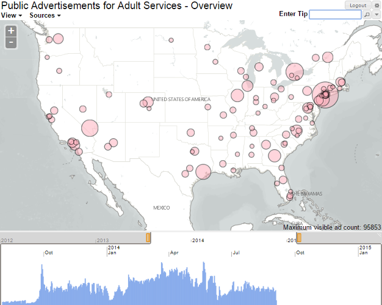
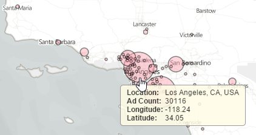
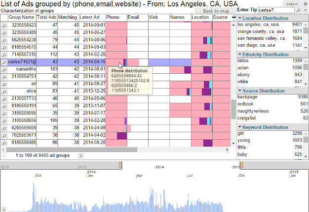
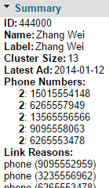
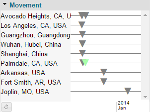
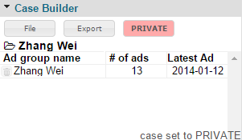

User Guide
==========

This guide is designed to help analysts understand how to use TellFinder to detect the behavior of individuals and organizations engaged in human trafficking by analyzing publicly available Internet escort advertisements.

	
The following topics are covered in this guide:

	<ol>
		<li>Overview</li>
		<li><a href="getting-started/">Getting Started</a></li>
		<li><a href="concepts/">Understanding TellFinder Concepts</a></li>
		<li><a href="interface/">Navigating the Interface</a></li>
	</ol>

For information about building, installing and running the Influent source code, see the [Development](../../community/development/overview/) page.

##  Analytic Scenario ##

Consider an analytic scenario in which a tip identifies an entity with the alias *cerise7*, who is allegedly involved in the trafficking of young girls in the *Los Angeles, CA* area. You can use TellFinder to locate entities who have used in Internet escort advertisements or who are otherwise associated with this alias.

Please note that names and other identifying attributes used in this scenario have been anonymized. 

##  Logging In ##

TellFinder can be accessed using any modern Web browser (e.g., Chrome, Firefox, Internet Explorer or Safari).

<h6 class="procedure">To start a new session</h6>

1. Open your Web browser and navigate to the location of your TellFinder Web server (e.g., `http://localhost:8080/tellfinder/`).
2. Enter the **User Name** and **Password** supplied to you by your administrator and click **Submit** to log in.

##  Beginning an Investigation ##

There are two ways you could use TellFinder to begin the investigation of the *cerise7* tip:

1. [Review a broad regional listing](#browse-region) of all posting activity in the Los Angeles area to look for relevant information.
2. [Perform a tip search](#tip-search) against the TellFinder databases to return a list of all ad groups that match the tip.

The following sections describe both starting points.

###  Browse by Region ###

The TellFinder home page illustrates the scope of scraped advertisements on a geographic map. Radial blooms over each city or region indicate how much activity was detected there; larger blooms indicate greater activity.

#### Panning and Zooming ####

The TellFinder map shares familiar controls with other modern Web-based map clients such as Google Maps. 

<h6 class="procedure">To zoom in or out</h6>

Perform any of the following actions:

- To quickly zoom in, double click on the area you want to view.
- Click the **Zoom In**  or **Zoom Out**  button in the upper left corner of the map.
- Hover your cursor over an area and use mouse scroll wheel to zoom in or out.

<h6 class="procedure">To pan</h6>

Click and drag any region of the map in the direction you want to view.

#### Investigating Regions ####

Each radial bloom on the map is an interactive control that enables you to access more information about the ads in that region. The blooms indicate how much activity occurred in the associated regions over the period specified in the timeline below the map.

<h6 class="procedure">To adjust the ad timeline</h6>

1. Click and drag either of the sliders above the the timeline where the years are displayed. The left slider specifies the start date while the right controls the end date.
2. Notice that the radial blooms on the map are automatically scaled up or down. The map only represents ads that were posted in the period you select.

<h6 class="procedure">To view the scope of ads scraped in Los Angeles</h6>

1. Hover your cursor over the group of radial blooms in Southern California. Because there is high advertising activity in this region, you may need to move around or zoom in until you locate Los Angeles.
2. Notice that TellFinder displays a tooltip that lists the total number of ads scraped that match this region.
3. Click on the Los Angeles bloom to reveal a menu of commands. Select **Show Entity List** to reveal the list of ad groups located in Los Angeles.
4. Scroll down through the table of ad groups until you find the `cerise70510@example.com` entry.

###  Perform a Tip Search ###

Instead of performing a broad region-based inspection of ads, you can quickly search the TellFinder databases for a tip.

<h6 class="procedure">To execute a tip search</h6>

1. Type *cerise7* in the **Enter Tip** field above the map on the Home page and press **ENTER**. Note that this field is also available on the list of resulting ad groups in case you need to alter your search parameters.
2. TellFinder returns a table of ad groups that match your criteria.

##  Examining Search Results ##

Whether you begin your investigation by browsing a specific region or by searching for a tip, the resulting list of ad groups is displayed in the same format.

The Ad Groups screen lists all of the entities that match the search criteria. In addition the ad timeline, the Ad Groups page summarizes the distribution of locations, ethnicities, source websites and human trafficking keywords referenced in the matching posts.

<h6 class="procedure">To review a particular result</h6>

1. Find the *cerise7* entry in the table of ad groups. Note that the ad group is named `cerise71621@example.com`; TellFinder automatically found the attribute that is *like* the criteria you entered.
2. Review each of the columns in the table. TellFinder indicates how many ads are in the group that belongs to the *cerise7* entity and when the latest post occurred.
3. Mouse over each of the columns with colored bars in them to view the distribution of attributes found in the ad group. The **Underage** column, for example, indicates that *cerise7* has used the keywords *girl*, *baby* and *fresh*, which may indicate the involvement of minors.

##  Examining Entities ##

Once you have reviewed the summary of the *cerise7* ad group, you can drill down into the entity that the group represents to review:

- Other entities or organizations to which the group is connected
- Details of the ad keywords, movement indicators and attributes
- Full contents of individual ads in the group

###  Reviewing the Entity Resolution Graph ###

The Entity Resolution graph shows other entities or organizations to which the selected entity is connected. Entity connections are determined by shared attributes (websites, phone numbers and email addresses) that appear across multiple ad groups.

The Entity Resolution graph supports both concentration and left-to-right layouts that highlight the distance of other entities and organizations to the selected entity.

<h6 class="procedure">To change the entity resolution graph layout</h6>

Click the **Toggle Layout**  button above the Entity Resolution legend.

#### Changing the Focus of an Investigation ####

In this analytic scenario, *cerise7* is directly connected to one other entity, *Zhang Wei*, because both have posted ads that include the same phone number.

Because all the other entities in the *cerise7* graph are connected to *Zhang Wei*, we will focus on this entity as its scope of activity is much deeper.

<h6 class="procedure">To change the entity on which you are focused</h6>

1. Click the entity node for *Zhang Wei* in the entity resolution graph.
2. Notice that the Ads table and distribution summaries are refreshed to show the relevant information for *Zhang Wei*.

###  Understanding Entity Details ###

The sidebar on the Entity Resolution page summarizes numerous keywords in the ads posted by the selected entity:

- **Summary**: Lists the distribution of strong identifying attributes (phone numbers, email address and websites), indicates how many ads were posted by the entity, and indicates why it is connected to the other entities and organizations in its graph.

- **Movement**: Shows a timeline of postings against the locations they are listed. For *Zhang Wei*, we see simultaneous postings in California and China, followed weeks later by postings in Arkansas and later Missouri.

- **Map**: Subset of the map on the Home page scaled and focused to show only the ad posting locations and counts of the selected entity. Here we see *Zhang Wei* cross-country and international activities.

- **Word Cloud**: Lists the most common words from the ads posted by the selected entity, where size indicates frequency of use. Here we see the posts made by *Zhang Wei* most often include the entities name, the sites where the ads are posted and a location, Shanghai. Other words that appear less frequently include adult services keywords and other locations where the entity has advertised.

- **Attributes**: Expanded density strip plots that show the distribution of different identifying attributes and keywords repeated across all the ads.

- **Images**: Summarizes the number of images shared across the associated ads

###  Examining Individual Ads ###

The Entity Resolution page also includes a table of all the ads posted by an entity or organization. 

For each entry, the following information is captured:

- Archived posting information: The time the ad was posted, the website that hosted it, the post title and contents, and the full URL.
- Extracted entity attributes and adult service keywords: Phone number, email address, hourly rate charged, ethnicity and associated images (which can be blurred for viewing in sensitive environments)

<h6 class="procedure">To view an archived version of a scraped ad</h6>

Click the Magnifying Glass icon to the left of the table entry and select **Launch in Poprox**.

<h6 class="procedure">To view the ad posting on the Internet</h6>

Click the Magnifying Glass icon to the left of the table entry and select **Show URL**. Note that because adult services advertisements are frequently removed from the Internet, older postings may no longer be available. 

##  Saving or Exporting Case Details ##

Once you find an entity or organization that you want to save for later investigation, you can build a TellFinder case that persists the entities information across sessions. Saved cases indicate the total number ads belonging to an entity and the most recent activity.

Creating cases also allows you to export the details of the entities you have saved. All exports are saved as CSV files that can be easily included in reports or shared with individuals who don't have access to TellFinder.

<h6 class="procedure">To build a new case in TellFinder</h6>

1. In the Entity Resolution graph, click the node of the entity or organization you want to save and drag it into the Case Builder module in the sidebar.
2. In the New Case dialog, enter a name for your case and click **OK**.
3. To add additional entities, simply drag them into the Case Builder module.

<h6 class="procedure">To export entity information to a CSV file</h6>

1. Click the **Export** button in the Case Builder module.
2. Select one of the following export types:
	- **Cluster CSV**: Summarizes the entities in your case and the number of ads they have posted
	- **Ads CSV**: Lists the complete details of all the ads posted by the entities in your case